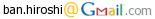

# **README on StereoScreening**

<div align="right">
Created    : "2010-08-17 12:25:39 ban"<br>
Last Update: "2021-12-13 07:29:30 ban"
</div>

<br>
<div align="center">


<br>
<br>
 
</div>
<br>

***

# <a name = "Menu"> **Menu** </a>

- [Introduction – what is StereoScreening ?](#Introduction)
- [System requirements](#System)
- [How to run StereoScreening](#Launch)
  - [Detailed descriptions of the StereoScreening](#Details)
  - [About the displayfile](#Displayfile)
  - [About the stimulusfile](#Stimulusfile)
- [Acknowledgments](#Acknowledgments)
- [License](#License)
- [Citations](#Citations)
- [TODOs](#TODOs)

***

# <a name = "Introduction"> **Introduction – what is StereoScreening ?** </a>

  

StereoScreening is a ***MATLAB***-based software package for testing individual stereo vision acuity before running the main psychophysics and/or neuroimaging experiments in vision science. The package is especially focusing on  
1. providing several stereo screening procedures only with this all-in-one package, and  
2. estimating the disparity discrimination threshold per participant precisely by the support of the external widely-used threshold estimation algorithm, ***psignifit***.  

(Matlab is a registered trademark of [***The Mathworks Inc.*** ](https://www.mathworks.com/) )  

The package supports two types of tasks below.  

- **A-or-B task**  (when sparam.reference_disparity=NaN. For details, please see the description of the stimulusfile below)  
&nbsp;&nbsp; **Sequence:** *stim -- blank -- response -- stim -- blank -- response -- stim -- blank -- response ...*  
&nbsp;&nbsp; The task is to judge whether the target plane is near (closer to you compared to the fixational plane) or far.  
  - press key 1 or left-mouse-click when the stimulus is to near (key 1/2 are defined in the display file)  
  - press key 2 or right-mouse-click when the stimulus is to far.  

- **2 AFC(IFC)**  (when sparam.reference_disparity is set as to be a real value (reference arcmin))  
&nbsp;&nbsp; **Sequence:** *stim(or ref) - blank - stim(or ref) - blank - resp - stim(or ref) -blank -- stim(or ref) -- blank -- resp ...*  
&nbsp;&nbsp; The task is to judge which (the first or the second) of the two planes is near.  
  - press key 1 or left-mouse-click when the first stimulus is to near (key 1/2 are defined in the display file)  
  - press key 2 or right-mouse-click when the second stimulus is to near.  

For more details, please read the descriptions below.  
Also please check the header comments in ~/StereoScreening/Presentation/StereoScreening.m.  

***Finally, the package is made publicly available in the hope of keeping our research group being transparent and open. Furthermore, the package is made open also for people who want to know our group's research activities, who want to join our group in the near future, and who want to learn how to create visual stimuli for vision science. Please feel free to contact us if you are interested in our research projects.***  

Thank you for using our software package.  
We are happy if StereoScreening can help your research projects.

[back to the menu](#Menu)

# <a name = "System"> **System requirements** </a>

- **OS: Windows 7/8/10, Mac OSX, or Linux**
  - note 1: Currently, you can run this script only on Windows OS since the psignifit tool linked from this script is only compatible with Windows.
  - note 2: To run StereoScreening on Mac OSX and Linux boxes, you have to set **psignifit** tool so that it works properly on these machines. Then, please change codes around **#line 1256-1309 of ~/StereoScreening/Presentation/StereoScreening.m**.

- **MATLAB R2009a** or later (We have tested the latest version with **R2020b** and **R2017a**), **Psychtoolbox** (for details, please see the [Acknowledgments](#Acknowledgments) section), and **Optimization** and **Image Processing** toolboxes.  
  - note 1: StereoScreening would work even without optimization/image_processing toolboxes, but to use full functionality of the software, these toolboxes are required.  
  - note 2: Psychtoolbox 3.0.15 or above is required. We have not tested the compatibility of StereoScreening with the former versions of PTB3 and PTB2.  

[back to the menu](#Menu)

# <a name = "Launch"> **How to run StereoScreening** </a>

***Running the script, StereoScreening***  
To run StereoScreening on MATLAB, please follow the commands below.  

```Matlab
>> cd ~/StereoScreening/Presentation
>> run_exp('name',acquisition_number);
```

Here, run_exp function is a simple wrapper for calling StereoScreening.m with participant-specific stimmulus configuration parameters stored in ~/StereoScreening/Presentation/subjects/'name' directory. The input variable, 'name' should be a string that specifies the name (or ID) of the participant, and acquisition_number should be an integer, such as 1, 2, 3,...  

**IMPORTANT NOTE (Windows only):**  
Before running the test, please configure the **psignifit** executables so that they can be called from the system, following one of the procedures below:  
1. Please add a path to the psignifit executables (psignifit-bootstrap.exe, psignifit-diagnostics.exe, and psignifit-mapestimate.exe, included in ~/StereoScreening/mpsignifit) to you 'PATH' environmental variable.
2. Or you can uncomment setenv() descriptions to set the environmental variable #line 298 in ~/StereoScreening/Presentation/StereoScreening.m.
3. Or please copy the psignifit executables to your system path such as C:\Windows\System32.

# <a name = "Details"> **Detailed descriptions of the StereoScreening.m** </a>

````Matlab
function StereoScreening(ID,acq,:displayfile,:stimlusfile,:gamma_table,:overwrite_flg,:force_proceed_flag)
(: is optional)
````

***About***  
The StereoScreening package displays rectangular planes with binocular disparities (+/- arcmins) for testing psychophysical depth discrimination acuity based on binocular disparity. The script should be used with MATLAB Psychtoolbox version 3 or above. The package is a full update of the old NearFarRectangleBehavior.m, which I had been using when I was running psychophysics stereo-vision experiments in UK, so as to be compatible with the new PTB3 toolbox.  

***Input/output variables of StereoScreening.m***  

[Input variables]  
<pre>
ID            : ID of the participant, a string, such as 's01', 'Hiroshi', or 'HB'
                the directory named as subj_name (e.g. 'HB') should be located in ~/StereoScreening/Presentation/subjects/
                under which configurations files are included. By changing parameters in the configuration files,
                stimulus type, size, colors, moving speed, presentation timing etc can be manipulated as you like.
                For details, please see the files in ~/StereoScreening/Presentation/subjects/_DEFAULT_.
                If subject directory does not exist in the specific directory described above, the parameters in the
                _DEFAULT_ directory will be automatically copied as subj_name and the default parameters are used for
                stimulus presentation. you can modify the default parameters later once the files are copied and the
                script is terminated.
                !!!!!!!!!!!!!!!!!! IMPORTANT NOTE !!!!!!!!!!!!!!!!!!!!!!!!
                !!! if 'debug' (case insensitive) is included          !!!
                !!! in subjID string, this program runs as DEBUG mode; !!!
                !!! stimulus images are saved as *.png format at       !!!
                !!! ~/StereoScreening/Presentation/images              !!!
                !!!!!!!!!!!!!!!!!! IMPORTANT NOTE !!!!!!!!!!!!!!!!!!!!!!!!
acq           : acquisition number (design file number),
                a integer, such as 1, 2, 3, ...
displayfile   : (optional) display condition file, such as 'shadow_display_fmri.m'
                as an example, please see ~/StereoScreening/subjects/_DEFAULT_/nf_display.m
stimulusfile  : (optional) stimulus condition file, such as 'shadow_stimulus_exp1.m'
                all of the stimuli in this script are generated in real-time based on
                the parameters in the stimulus file. For details, please see this
                function and the other function in ../Generation and ../Common directories.
                as an example, please see ~/StereoScreening/subjects/_DEFAULT_/nf_stimulus.m
gamma_table   : (optional) table(s) of gamma-corrected video input values (Color LookupTable).
                256(8-bits) x 3(RGB) x 1(or 2,3,... when using multiple displays) matrix
                or a *.mat file specified with a relative path format. e.g. '/gamma_table/gamma1.mat'
                The *.mat should include a variable named "gamma_table" consists of a 256x3xN matrix.
                if you use multiple (more than 1) displays and set a 256x3x1 gamma-table, the same
                table will be applied to all displays. if the number of displays and gamma tables
                are different (e.g. you have 3 displays and 256x3x!2! gamma-tables), the last
                gamma_table will be applied to the second and third displays.
                if empty, normalized gamma table (repmat(linspace(0.0,1.0,256),3,1)) will be applied.
overwrite_flg : (optional) whether overwriting pre-existing result file. if 1, the previous result
                file with the same acquisition number will be overwritten by the previous one.
                if 0, the existing file will be backed-up by adding a prefix '_old' at the tail
                of the file. 0 by default.
force_proceed_flag : (optional) whether proceeding stimulus presentation without waiting for
                the experimenter response (e.g. pressing the ENTER key) or a trigger.
                if 1, the stimulus presentation will be automatically carried on.
</pre>

***IMPORTANT NOTE (Windows only):***  
The displayfile & stimulusfile described above should be located at ~/StereoScreening/Presentation/subjects/(ID)/, like  
~/StereoScreening/Presentation/subjects/(ID)/display_A_setup.m  
~/StereoScreening/Presentation/subjects/(ID)/stimulus_A_setup.m  

To customize the stimulus presentation/controlling parameters, please change the contents of these files per participant following the detailed instructions described below. Or you can change the default parameters by modifying the contents of ~/StereoScreening/subjects/(ID) depending on your purpose.  

[Output variables]  
No output matlab variable.  

[Result file]  
All the results, including participant responses, performance, stimulus parameters etc will be stored in  
~/StereoScreening/subjects/(ID)/results/(today)  
as ./subjects/(ID)/results/(today)/(ID)_StereoScreening_results_run_(run_num).mat  

[Example]  
````Matlab
>> StereoScreening('s01',1,'nf_display.m','nf_stimulus_exp1.m')
````

[back to the menu](#Menu)

# <a name = "Displayfile"> **About the displayfile** </a>

An example of the displayfile is as below.

````MATLAB
************************************************************
This_is_the_display_file_for_StereoScreening.
Please_change_the_parameters_below.
StereoScreening.m
Programmed_by_Hiroshi_Ban___Aug_24_2015
************************************************************

% display mode, one of "mono", "dual", "dualcross", "dualparallel", "cross", "parallel", "redgreen", "greenred",
% "redblue", "bluered", "shutter", "topbottom", "bottomtop", "interleavedline", "interleavedcolumn", "propixxmono", "propixxstereo"
dparam.ExpMode='shutter';%'cross';

dparam.scrID=1; % screen ID, generally 0 for a single display setup, 1 for dual display setup

% a method to start stimulus presentation
% 0:ENTER/SPACE, 1:Left-mouse button, 2:the first MR trigger pulse (CiNet),
% 3:waiting for a MR trigger pulse (BUIC) -- checking onset of pin #11 of the parallel port,
% or 4:custom key trigger (wait for a key input that you specify as tgt_key).
dparam.start_method=1;

% a pseudo trigger key from the MR scanner when it starts, only valid when dparam.start_method=4;
dparam.custom_trigger=KbName(84);

%% keyboard settings
dparam.Key1=37; % key 1 = near
dparam.Key2=39; % key 2 = far

%% whether giving correct/incorrect feedback
% 0 = no feedback, 1 = giving correct (green fixation and high-tone sound) or incorrect(red fixation and low-tone sound) feedbacks
dparam.givefeedback=1;

% screen settings

%%% whether displaying the stimuli in full-screen mode or as is (the precise resolution), 'true' or 'false' (true)
dparam.fullscr=false;

%%% the resolution of the screen height
dparam.ScrHeight=1200;

%% the resolution of the screen width
dparam.ScrWidth=1920;

% whther skipping the PTB's vertical-sync signal test. if 1, the sync test is skipped
dparam.skip_sync_test=0;
````

[back to the menu](#Menu)

# <a name = "Stimulusfile"> **About the stimulusfile** </a>

An example of the stimulusfile is as below.

````MATLAB
************************************************************
This_is_the_stimulus_parameter_file_for_StereoScreening.
Please_change_the_parameters_below.
StereoScreening.m
Programmed_by_Hiroshi_Ban___Aug_24_2015
***********************************************************

% "sparam" means "stimulus generation parameters"

%%% image size
sparam.outerRectFieldSize=[8,8]; % target stimulus size in deg, [row,col]
sparam.innerRectFieldSize=[4,4]; % target stimulus size in deg, [row,col]
sparam.gapRectFieldSize=[0,0];   % widths [row(top and bottom),col(right and left)] of the gap between inner and outer rectangles in deg (if 0, no gap). gapRectFieldSize + innerRectFieldSize < outerRectFieldSize

%%% disparity magnitude(s)
sparam.base_disparity=0;         % target base disparity in deg (if non-zero, the target plane is located to near/far side compared to the fixation plane)
sparam.disparity=[8,  4,  2,  1, 0.5, -0.5, -1, -2, -4, -8]; % target disparities in arcmin

% when sparam.reference_disparity is NaN, the task is 1AFC in which participants have to judge whether the target
% is located to near or far, while, when this value is set to a specific disparity (arcmins), the task becomes 2AFC
% in which particpants have to judge which of the planes (the first or the second) is located to near.
sparam.reference_disparity=NaN;

%%% the number of trials for each stimulus condition
sparam.numTrials=30;

%%% RDS parameters
sparam.dotRadius=[0.05,0.05]; % radius of RDS's white/black ovals
sparam.dotDens=2; % deinsity of dot in RDS image (1-100)
sparam.colors=[255,0,128]; % RDS colors [dot1,dot2,background](0-255)
sparam.oversampling_ratio=2; % oversampling_ratio for fine scale RDS images, [val]

%%% RDS noise paramters
% when sparam.noise_mode='none' (no noise condition), all parameters related to noise are ignored.
% when sparam.noise_mode='anti' (anticorrelated (left/right dot colors are flipped) RDSs are presented), only sparam.noise_ratio is used in generating RDSs.
% when sparam.noise_mode='snr'  (noises are added in disparities), please set all the noise-related paramters carefully.
sparam.noise_mode='none';  % one of 'none', 'anti', and 'snr'
sparam.noise_ratio=30;     % percentage (0-100) of noises in the RDS, used when sparam.noise_mode='anti' or sparam.noise_mode='snr'
sparam.noise_mean=0;       % noise mean in disparity (arcmin), used only when sparam.noise_mode='snr'
sparam.noise_sd=5;         % noise SD in disparity (arcmin), used only when sparam.noise_mode='snr'
sparam.noise_method='add'; % one of 'add' and 'replace', used only when sparam.noise_mode='snr'

% stimulus display durations in msec

% initial fixation duration in msec
sparam.initial_fixation_time=1000;

%%% duration in msec for each condition
sparam.condition_duration=2000;

%%% duration in msec for simulus ON period for each trial, integer (1)
sparam.stim_on_duration=1000;

%%% duration in msec for each trial
sparam.BetweenDuration=500;

%%% fixation size & color
sparam.fixsize=24; % radius in pixels
sparam.fixlinesize=[12,2]; % [height,width] of the fixation line in pixel
sparam.fixcolor=[255,255,255];

%%% background color
sparam.bgcolor=[128,128,128];

%%% RGB for background patches
sparam.patch_size=[30,30];   % background patch size, [height,width] in pixels
sparam.patch_num=[20,20];    % the number of background patches along vertical and horizontal axis
sparam.patch_color1=[255,255,255]; % 1x3 matrices
sparam.patch_color2=[0,0,0];       % 1x3 matrices

%%% size parameters
run(fullfile(fileparts(mfilename('fullpath')),'sizeparams'));
%sparam.ipd=6.4;
%sparam.pix_per_cm=57.1429;
%sparam.vdist=65;
````

[back to the menu](#Menu)

# <a name = "Acknowledgments"> **Acknowledgments** </a>

The StereoScreening package uses **Psychtoolboox** library for generating/presenting/controlling binocular disparity stimuli, and **Psignifit (mpsignifit)** tool for computing the subject discrimination thresholds and psychometric functions.  
We would like to express our sincere gratitudes to the authors for sharing these great tools.  

**Psychtoolbox** : The individual Psychtoolbox core developers,  
            (c) 1996-2011, David Brainard  
            (c) 1996-2007, Denis Pelli, Allen Ingling  
            (c) 2005-2011, Mario Kleiner  
            Individual major contributors:  
            (c) 2006       Richard F. Murray  
            (c) 2008-2011  Diederick C. Niehorster  
            (c) 2008-2011  Tobias Wolf  
            [ref] [http://psychtoolbox.org/HomePage](http://psychtoolbox.org/HomePage)

**Psignifit** : A free toolbox for psychometric function estimation.  
           Develped by Dr Ingo Frund, Dr Valentin Hanel and Dr Felix Wichmann.  
           [ref 1] [https://github.com/wichmann-lab/psignifit/wiki](https://github.com/wichmann-lab/psignifit/wiki)  
           [ref 2] [https://github.com/wichmann-lab/psignifit/archive/master.zip](https://github.com/wichmann-lab/psignifit/archive/master.zip)  

[back to the menu](#Menu)

# <a name = "License"> **License** </a>

<br>

StereoScreening --- A MATLAB software package for stereo vision screening; a simple test for estimating psychophysical depth discrimination performance based on binocular disparity. Copyright (c) 2010, Hiroshi Ban. All rights reserved.  

Redistribution and use in source and binary forms, with or without modification, are permitted provided that the following conditions are met:  

    * Redistributions of source code must retain the above copyright
      notice, this list of conditions and the following disclaimer.
    * Redistributions in binary form must reproduce the above copyright
      notice, this list of conditions and the following disclaimer in
      the documentation and/or other materials provided with the distribution

THIS SOFTWARE IS PROVIDED BY THE COPYRIGHT HOLDERS AND CONTRIBUTORS "AS IS" AND ANY EXPRESS OR IMPLIED WARRANTIES, INCLUDING, BUT NOT LIMITED TO, THE IMPLIED WARRANTIES OF MERCHANTABILITY AND FITNESS FOR A PARTICULAR PURPOSE ARE DISCLAIMED. IN NO EVENT SHALL THE COPYRIGHT OWNER OR CONTRIBUTORS BE LIABLE FOR ANY DIRECT, INDIRECT, INCIDENTAL, SPECIAL, EXEMPLARY, OR CONSEQUENTIAL DAMAGES (INCLUDING, BUT NOT LIMITED TO, PROCUREMENT OF SUBSTITUTE GOODS OR SERVICES; LOSS OF USE, DATA, OR PROFITS; OR BUSINESS INTERRUPTION) HOWEVER CAUSED AND ON ANY THEORY OF LIABILITY, WHETHER IN CONTRACT, STRICT LIABILITY, OR TORT (INCLUDING NEGLIGENCE OR OTHERWISE) ARISING IN ANY WAY OUT OF THE USE OF THIS SOFTWARE, EVEN IF ADVISED OF THE POSSIBILITY OF SUCH DAMAGE.  

The views and conclusions contained in the software and documentation are those of the authors and should not be interpreted as representing official policies, either expressed or implied, of the FreeBSD Project.  

[back to the menu](#Menu)

# <a name = "Citations"> **Citations of StereoScreening** </a>

If you have some space in your reference section, please cite this GitHub repository like,

**StereoScreening toolbox: https://github.com/hiroshiban/StereoScreening**  
**by Hiroshi Ban**  

If you have no space, please cite it somewhere someday next time. Thank you so much.

[back to the menu](#Menu)

# <a name = "TODOs"> **TODOs** </a>

1. Provides some other types of test stimuli, such as curvatures.
2. Compiling *.m files using the MATLAB compiler so that we can provide a standalone verion of the StereoScreening package.

[back to the menu](#Menu)
